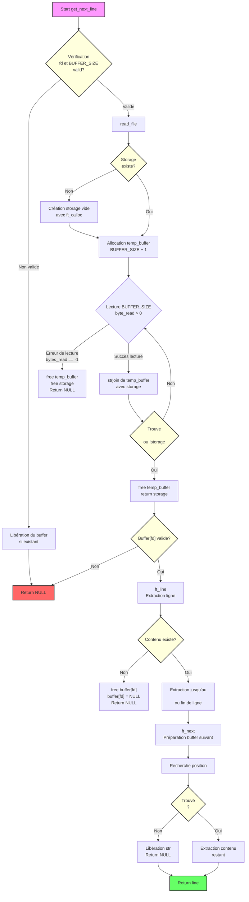

# Get Next Line (GNL)

## Description
Get Next Line est une fonction qui permet de lire le contenu d'un fichier ligne par ligne. Cette fonction est particulièrement utile pour traiter des fichiers texte de manière séquentielle, en retournant une ligne à chaque appel jusqu'à la fin du fichier.

## Prototype de la fonction
```c
char *get_next_line(int fd);
```

## Paramètres
- `fd` : Le descripteur de fichier à partir duquel lire

## Valeur de retour
- Une ligne de texte depuis le fichier
- `NULL` si la lecture est terminée ou si une erreur survient

## Fonctionnement détaillé



### 1. Fonction principale : get_next_line
```c
char *get_next_line(int fd)
```
La fonction principale utilise un buffer statique pour conserver les données entre les appels. Elle :
- Vérifie la validité des paramètres (fd, BUFFER_SIZE)
- Gère les erreurs de lecture
- Coordonne les opérations de lecture et de traitement des lignes
- Maintient l'état entre les appels grâce au buffer statique

### 2. Fonction read_file
```c
char *read_file(int fd, char *str)
```
Cette fonction est responsable de :
- Lire le fichier par blocs de BUFFER_SIZE octets
- Accumuler les données lues dans une chaîne
- Continuer la lecture jusqu'à trouver un retour à la ligne ou la fin du fichier
- Gérer la mémoire dynamique pour le stockage des données

### 3. Fonction ft_line
```c
char *ft_line(char *str)
```
Cette fonction :
- Extrait la première ligne du buffer
- Alloue la mémoire nécessaire pour la ligne
- Copie les caractères jusqu'au premier '\n' ou la fin de la chaîne
- Gère le cas particulier du retour à la ligne

### 4. Fonction ft_next
```c
char *ft_next(char *str)
```
Cette fonction :
- Prépare le buffer pour le prochain appel
- Supprime la ligne déjà lue
- Conserve le reste du buffer pour la prochaine lecture
- Gère la mémoire de manière efficace

## Gestion de la mémoire

Le programme utilise plusieurs mécanismes pour gérer la mémoire efficacement :
1. Un buffer statique pour conserver les données entre les appels
2. Libération systématique de la mémoire en cas d'erreur
3. Gestion des fuites de mémoire via des free appropriés
4. Utilisation de ft_calloc pour une initialisation sécurisée

## Cas particuliers gérés

1. Fichiers invalides ou erreurs de lecture
2. Buffer vide
3. Lignes de différentes longueurs
4. Fin de fichier
5. Erreurs de mémoire

## Limitations

- Le programme est limité par BUFFER_SIZE
- Dépend de la limite système OPEN_MAX pour le nombre de fichiers
- La performance peut varier selon la taille du BUFFER_SIZE

## Utilisation

Exemple d'utilisation :
```c
int fd;
char *line;

fd = open("fichier.txt", O_RDONLY);
if (fd < 0)
    return (-1);

line = get_next_line(fd);
while (line != NULL)
{
    printf("%s", line);
    free(line);
    line = get_next_line(fd);
}
close(fd);
```

## Dépendances

Le programme nécessite les fonctions suivantes (à implémenter séparément) :
- ft_calloc
- ft_strjoin
- ft_strchr
- ft_strlen

## Comportements spécifiques

1. La fonction gère correctement :
   - Les fichiers vides
   - Les lignes sans retour à la ligne final
   - Les erreurs de lecture
   - La fermeture inopinée du fichier

2. Gestion de la mémoire :
   - Libération automatique du buffer en cas d'erreur
   - Pas de fuites de mémoire en utilisation normale
   - Gestion propre des cas d'erreur d'allocation

## Conseils d'optimisation

1. Ajuster BUFFER_SIZE selon les besoins :
   - Petit BUFFER_SIZE : économie de mémoire
   - Grand BUFFER_SIZE : meilleures performances

2. Vérifier la gestion de la mémoire :
   - Utiliser Valgrind pour détecter les fuites
   - Tester avec différentes tailles de fichiers